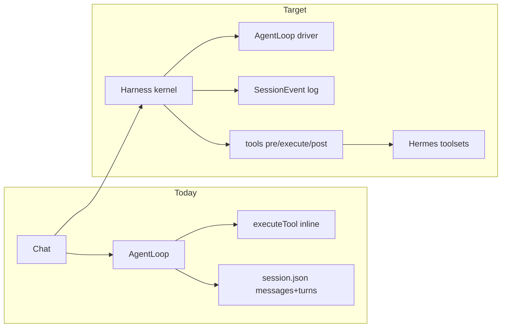

# Hybrid harness — DeepSeek seams + Hermes capabilities

## Summary

Open Agent already has Hermes *capabilities*. DeepSeek Harness is stronger as a *runtime*: replaceable loop, event-sourced session, tool waterfalls, inject inbox.

Cherry Studio only shells out to `dsh`. We will **not** embed Cordis or spawn DeepSeek’s CLI. We will grow a small in-process kernel that copies DeepSeek’s **seams**, with Hermes tools/memory/skills/MoA as the first (and default) plugins.


```mermaid
flowchart LR
  subgraph today [Today]
    Chat --> Loop[AgentLoop]
    Loop --> Tools[executeTool inline]
    Loop --> JSON[session.json messages+turns]
  end
  subgraph next [Target]
    Chat --> Kernel[Harness kernel]
    Kernel --> Driver[AgentLoop driver]
    Kernel --> Log[SessionEvent log]
    Kernel --> Pipe[tools pre/execute/post]
    Pipe --> Hermes[Hermes toolsets]
  end
```

## Contract

- User-visible chat, Settings, vault tools, approval, steer, MoA, cron, MCP **keep current behaviour**.
- Internally: a **turn** may contain many **steps**; UI can keep saying “iteration”.
- Trajectory and recovery read `Session.events`. The lossless model wire stays `messages[]` (vision parts, unclipped tool payloads). Events are clipped/text-only — they must not replace a complete wire. `resumeMessages` uses the log only when messages are missing or shorter.
- Hooks exist so a later driver (e.g. MoA-only loop) does not fork `executeTool`.
- No Cordis dependency. No `dsh` child process.

## Decisions

- D1: Patterns only, not Cordis — `[assumed]` from Obsidian plugin constraints
- D2: Keep Hermes tool/approval/skill/memory semantics verbatim — existing ports
- D3: First code slice = tool waterfall + typed session events, not a rewrite of `tools.ts`
- D4: Profiles stay Hermes identities, not DeepSeek bundle trees — `[assumed]`
- D5: Trajectory **UI** = topbar **button → panel** (same pattern as Conversations). Not a Chat|Trajectory tab. Not inline-only as the primary surface. Owner 2026-09-11. Panel default closed; transcript stays behind. Empty chrome before `events[]` exist is forbidden — log first, then wire the button.

| Pick | Approach | Tradeoff |
| --- | --- | --- |
| A | Vendor Cordis / spawn dsh | Wrong host; huge; Cherry-style only |
| B | Thin kernel + Hermes plugins | Extra types; incremental |
| C | Status quo AgentLoop | Fast; loop stays a god-object |

**Pick B.**

## Impact

Touches later: `src/agent/agentLoop.ts`, `sessions.ts`, `runner.ts`, ChatApp persistence.

Does **not** change: Settings UI, tool schemas, web search backends, vault policy.

Chat chrome (after Phase 1 log exists): one topbar control that opens a trajectory panel; no second primary tab.

## Phases

### Phase 0 — study (this commit)

Goal: documented map. Files: this plan + study note.

### Phase 1 — session events (additive)

Goal: append `events[]` beside existing `turns`/`messages`; project wire from events when present.

Shipped (log only): `Session.events`, `sessionEvents.ts`, `AgentLoop` appends turn/step/message/tool events; ChatApp persist/load/branch. `eventsToWire` reconstructs conversation messages (no system prompt). Load/branch use `resumeMessages`: the lossless `messages[]` wire wins when it is at least as long as the event projection; events fill gaps (empty or shorter messages). Multimodal `content` parts always keep `messages[]`. Persist writes both, never projects messages from clipped events.

Phase 1b (shipped): topbar Trajectory button opens a Conversations-style panel that projects `events[]`. Not a Chat|Trajectory tab. Live `onSessionEvent` updates the panel during a run. Source filter + inject field on the panel (`inject()` on the live handle; `/steer` still works).

Verification: session sanitize + load/save tests still green; old files without `events` still load.

### Phase 2 — tool waterfall

Goal: `preExecute` / `execute` / `postExecute` listeners used by approval, redact, steer — `AgentLoop.executeTool` becomes the default driver of that pipeline.

Shipped: `toolWaterfall.ts`; approval + abort are preExecute; steer-escape / redact / clip are postExecute. Execute still only in `executeTool`. `/steer` inject stays Phase 3.

Verification: existing tools tests + approval tests.

### Phase 3 — turn/step naming + inject inbox

Goal: `inject()` lands on next admitted step (DeepSeek); `/steer` becomes one inject consumer.

Shipped: `InjectInbox`; `AgentLoop.inject` / `steer` share it; drain at step start; `inject` session event matches the wire marker. Interrupt still clears leftover. `/steer` UI unchanged.

### Phase 4 — swappable driver

Goal: `AgentLoop` and `MoaTurnEngine` share the kernel interface; no second execute path.

Shipped: `HarnessRequestPrep` (`harness.ts`). `AgentLoop` is the only turn driver and the only `executeTool` path. `MoaTurnEngine` implements request prep (wire + aggregator slot), not a second loop. `InteractiveRunHandle.inject` matches the driver.

## GWT

```text
Given a session saved before events[]
When the plugin loads it
Then turns and messages still work; events is empty/synthesized, not a crash

Given a tool call
When preExecute denies
Then the model sees the deny payload and execute never runs

Given /steer during a tool batch
When the next step starts
Then inject is on the log and on the wire, same bytes
```

## Risks

> [!risk]
> Big-bang rewrite of AgentLoop — mitigasi: additive events; `messages[]` stays the lossless wire.
>
> Cordis-shaped APIs leaking into UI — mitigasi: ChatApp still consumes turns; Trajectory projects `events[]`.

## Remaining (out of scope)

- Dual persist `messages[]` + `events[]` — keep both; do not project the wire from clipped events
- System prompt and compression cache stay off the event log
- Image bytes stay on `messages[]`; events store `images` count only

## Open Questions

- q1: Persist JSONL like dsh or stay one JSON file? — default: one JSON file (`events` array) to keep vault adapter simple
- q2: Expose hook UI to users? — default: no; internal only
