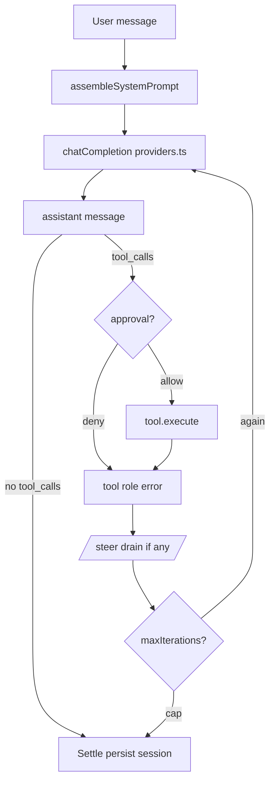
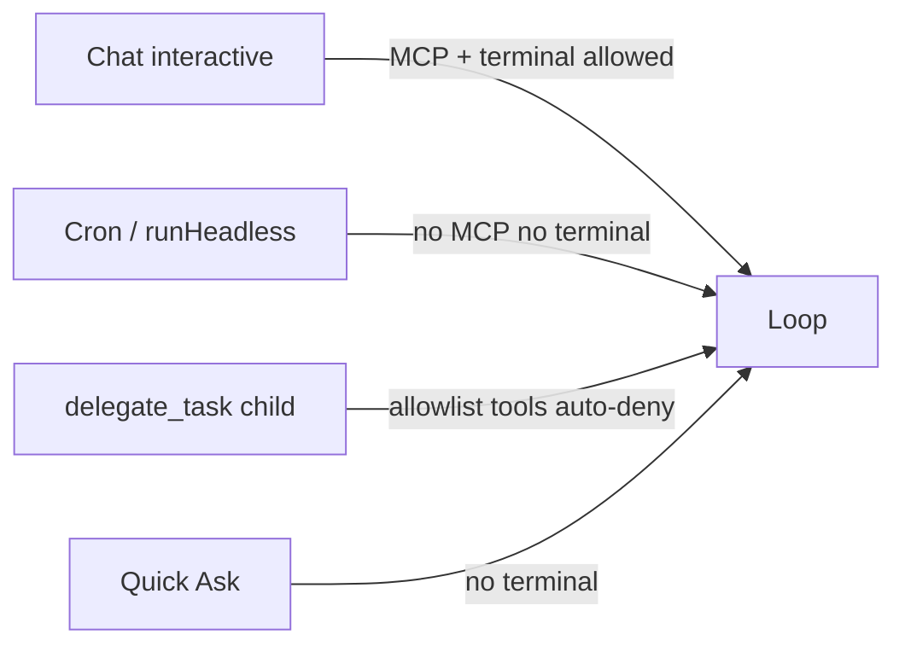

# Open Agent — arsitektur

Satu peta sistem. Bukan clone Hermes Desktop, bukan Cordis/DeepSeek Harness.
Host-nya **Obsidian**; agen berjalan **in-process** di plugin.

Dokumen lanjutan **tidak** dipecah dulu menjadi banyak file kosong. Bagian di
bawah + tautan ke audit/plan yang sudah ada. Pecah hanya jika satu bagian
tumbuh sendiri (tools, session, security).

- Hub docs: [README](../README.md)
- Paritas otoritas Hermes: [audit 2026-08-25](../audits/hermes-desktop-architecture-parity-2026-08-25.md)
- Refresh Desktop: [audit 2026-09-11](../audits/hermes-desktop-refresh-2026-09-11.md)
- Arah kernel: [hybrid DeepSeek + Hermes](../plans/deepseek-hermes-hybrid-harness-2026-09-06.md)
- Workspace: [path security](workspace-security.md)

Jangan buat `ARCHITECTURE.md` di root repo — sumber kebenaran arsitektur
adalah file ini (`docs/reference/architecture.md`).

---

## 1. Tiga otoritas

Hermes Desktop: Electron / renderer / `hermes serve`.  
Kita: **plugin lifecycle / UI / runner+loop** — satu proses Obsidian.

| Otoritas | File | Boleh benar tentang |
| --- | --- | --- |
| Host | `src/main.ts` | Lifecycle plugin, view, cron tick, inject MCP/terminal, `data.json` |
| Domain | `AgentRunner` + `AgentLoop` + `src/agent/*` | Prompt, tool, model HTTP, kebijakan workspace, child/headless |
| UI | `ChatApp`, settings, Quick Ask | Composer, antrian, kartu tool, approval/clarify **callback** |

UI **tidak** boleh `new AgentLoop` — hanya `InteractiveRunHandle` (`run` / `steer`).

Ini **bukan** “semua komponen plugin Cordis”. Saklar Settings = **feature flag**
Hermes (toolset ON/OFF). Ganti implementasi loop tetap ubah kode, sampai seam
DeepSeek (rencana, belum ship).

---

## 2. Satu giliran chat

Istilah UI: **iteration**. Istilah DeepSeek nanti: **step** = satu request
model + tool-nya; **turn** = sampai model berhenti minta tool.

Inti loop: `AgentLoop.run` di `src/agent/agentLoop.ts`.

Sisipan:

- **Failover** — `resilience.ts`, sekali per run
- **MoA** — `moaLoop.prepareIteration` sebelum request; aggregator yang acting
- **Steer** — stash, nempel di tool result terakhir
- **Kompresi** — ChatApp, bukan di dalam loop (kontrak v0.1.17)

---

## 3. Mode eksekusi

Satu kelas loop; **set tool berbeda** (fail-closed).

| Mode | Pintu | MCP | Terminal | Todo |
| --- | --- | --- | --- | --- |
| Interactive | `createInteractiveRun` | ya, jika consent | desktop + opt-in | session file |
| Headless / cron | `runHeadless` | tidak | tidak | ephemeral |
| Child | `delegate.ts` allowlist | tidak | tidak | ephemeral |
| Quick Ask | overlay | tidak | tidak | — |

Capability baru default **mati** di child/headless sampai di-review.

---

## 4. Data dan cakupan

- Kunci API: **global** plugin (pilihan produk).
- Memory / skills / sessions: per **profile**; Strict mode menambah partisi folder.
- Satu run memegang **snapshot** policy + session store — ganti profile di tengah
  await tidak menulis ke partisi baru.

Layout vault: lihat [README](../../README.md) bagian Data layout.

---

## 5. Peta modul `src/agent`

| Modul | Peran |
| --- | --- |
| `runner.ts` | Komposisi: tools, ctx, prompt, interactive/headless |
| `agentLoop.ts` | Driver: request → tools → repeat |
| `providers.ts` | HTTP OpenAI-compatible + SSE |
| `tools.ts` | Registry Hermes toolsets |
| `systemPrompt.ts` | Susun system prompt |
| `sessions.ts` | JSON session + search |
| `memory.ts` / `memoryEngine.ts` | MEMORY.md + engine fakta |
| `skills.ts` / `hub.ts` | SKILL.md + Browse Hub |
| `moa.ts` / `moaLoop.ts` | Config + facade penasihat |
| `webSearch.ts` / `webExtract.ts` | Search backend vs fetch URL |
| `workspacePolicy.ts` | Whole / Preferred / Strict |
| `cron.ts` | Automations |
| `mcp/` `terminal/` | Hanya jalur interactive |

UI: `src/ui/`. Settings: `src/settings.ts` + `settingsTab.ts` + `settings/sections/`.

---

## 6. Yang sengaja bukan arsitektur kita

| Bukan | Mengapa |
| --- | --- |
| `ARCHITECTURE.md` di root | Duplikat; hub = `docs/` |
| Cordis / spawn `dsh` | Host salah; Cherry pun hanya child-process |
| `hermes serve` + gateway | Obsidian sudah host |
| Voice / Cloud Desktop | Produk Electron, bukan vault |
| Saklar = ganti implementasi | Itu flag; seam pengganti masih rencana |

---

## 7. Dokumen lanjutan — kapan pecah

Cukup file ini sampai ada kebutuhan nyata:

| Kalau topik ini menggemuk | Baru pecah ke |
| --- | --- |
| Event log session / turn vs step | `docs/reference/session-log.md` setelah Phase 1 hybrid |
| Pipeline tool + approval | tautkan `tools.ts` + safety di working-agreement |
| MCP/terminal boundaries | tetap [SECURITY.md](../../SECURITY.md) + workspace-security |

Jangan membuat ensiklopedia spekulatif. Plan hybrid tetap di
[plans/deepseek-hermes-hybrid-harness-2026-09-06.md](../plans/deepseek-hermes-hybrid-harness-2026-09-06.md)
sampai kodenya ship.
