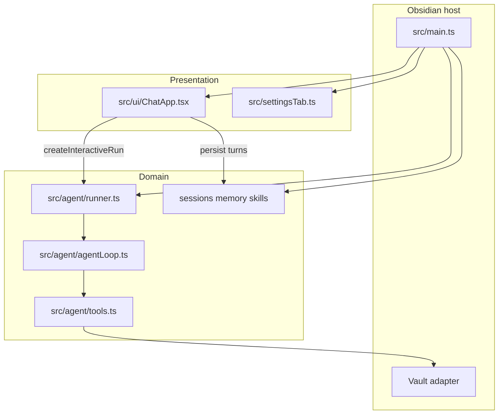
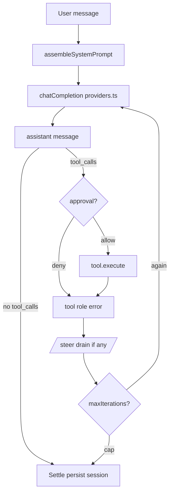
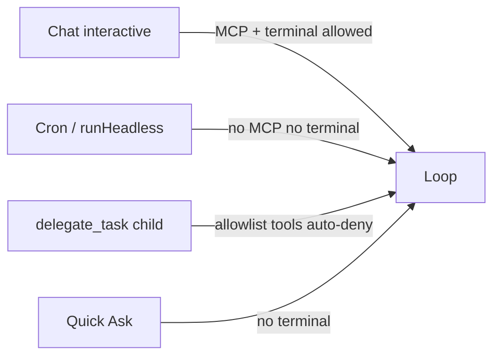
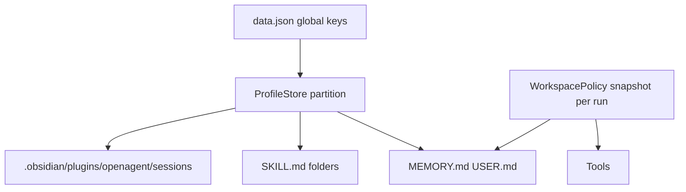

# Open Agent architecture

One system map. Not a clone of Hermes Desktop, not Cordis / DeepSeek Harness.
The host is **Obsidian**; the agent runs **in-process** in the plugin.

Do **not** split this into empty sibling files yet. Split only when one topic
grows on its own (tools, session, security).

- Docs hub: [README](../README.md)
- Hermes authority parity: [audit 2026-08-25](../audits/hermes-desktop-architecture-parity-2026-08-25.md)
- Desktop refresh: [audit 2026-09-11](../audits/hermes-desktop-refresh-2026-09-11.md)
- Kernel direction: [hybrid DeepSeek + Hermes](../plans/deepseek-hermes-hybrid-harness-2026-09-06.md)
- Workspace: [path security](workspace-security.md)

Do not add `ARCHITECTURE.md` at the repo root — this file is the architecture
source of truth (`docs/reference/architecture.md`).

---

## 1. Three authorities

Hermes Desktop: Electron / renderer / `hermes serve`.
Here: **plugin lifecycle / UI / runner+loop** — one Obsidian process.

| Authority | File | Allowed to be right about |
| --- | --- | --- |
| Host | `src/main.ts` | Plugin lifecycle, views, cron tick, MCP/terminal inject, `data.json` |
| Domain | `AgentRunner` + `AgentLoop` + `src/agent/*` | Prompt, tools, model HTTP, workspace policy, child/headless |
| UI | `ChatApp`, settings, Quick Ask | Composer, queue, tool cards, approval/clarify **callbacks** |

UI must **not** `new AgentLoop` — only `InteractiveRunHandle` (`run` / `steer`).

Settings toggles are Hermes **feature flags** (toolset ON/OFF), not a Cordis
plugin tree. Replacing the loop implementation still means changing code until
DeepSeek seams ship (planned, not shipped).

---

## 2. One chat turn

UI term: **iteration**. Later DeepSeek terms: **step** = one model request plus
its tools; **turn** = until the model stops requesting tools.

Loop core: `AgentLoop.run` in `src/agent/agentLoop.ts`.

Inserts:

- **Failover** — `resilience.ts`, once per run
- **MoA** — `moaLoop.prepareIteration` before the request; aggregator acts
- **Steer** — stash, attached to the last tool result
- **Compression** — ChatApp, not inside the loop (v0.1.17 contract)

---

## 3. Execution modes

One loop class; **different tool sets** (fail-closed).

| Mode | Entry | MCP | Terminal | Todo |
| --- | --- | --- | --- | --- |
| Interactive | `createInteractiveRun` | yes, if consent | desktop + opt-in | session file |
| Headless / cron | `runHeadless` | no | no | ephemeral |
| Child | `delegate.ts` allowlist | no | no | ephemeral |
| Quick Ask | overlay | no | no | — |

New capabilities default **off** on child/headless until reviewed.

---

## 4. Data and scope

- API keys: plugin-**global** (product choice).
- Memory / skills / sessions: per **profile**; Strict mode also partitions by folder.
- A run holds a **snapshot** of policy + session store — switching profile mid-await
  must not write into the new partition.

Vault layout: [README](../../README.md) Data layout.

---

## 5. `src/agent` module map

| Module | Role |
| --- | --- |
| `runner.ts` | Composition: tools, ctx, prompt, interactive/headless |
| `agentLoop.ts` | Driver: request → tools → repeat |
| `providers.ts` | OpenAI-compatible HTTP + SSE |
| `tools.ts` | Hermes toolset registry |
| `systemPrompt.ts` | System prompt assembly |
| `sessions.ts` | JSON sessions + search |
| `memory.ts` / `memoryEngine.ts` | MEMORY.md + fact engine |
| `skills.ts` / `hub.ts` | SKILL.md + Browse Hub |
| `moa.ts` / `moaLoop.ts` | Config + advisor facade |
| `webSearch.ts` / `webExtract.ts` | Search backend vs URL fetch |
| `workspacePolicy.ts` | Whole / Preferred / Strict |
| `cron.ts` | Automations |
| `mcp/` `terminal/` | Interactive path only |

UI: `src/ui/`. Settings: `src/settings.ts` + `settingsTab.ts` + `settings/sections/`.

---

## 6. Intentionally not our architecture

| Not this | Why |
| --- | --- |
| Root `ARCHITECTURE.md` | Duplicate; hub is `docs/` |
| Cordis / spawn `dsh` | Wrong host; even Cherry only child-processes it |
| `hermes serve` + gateway | Obsidian is already the host |
| Desktop Voice / Cloud | Electron product, not a vault plugin |
| Toggle = swap implementation | That is a flag; replacement seams are still a plan |

---

## 7. When to split this file

This file is enough until a topic actually grows:

| If this topic gets fat | Split into |
| --- | --- |
| Session event log / turn vs step | `docs/reference/session-log.md` after hybrid Phase 1 |
| Tool pipeline + approval | keep `tools.ts` + Safety in the working agreement |
| MCP/terminal boundaries | [SECURITY.md](../../SECURITY.md) + workspace-security |

No speculative encyclopedia. The hybrid plan stays in
[plans/deepseek-hermes-hybrid-harness-2026-09-06.md](../plans/deepseek-hermes-hybrid-harness-2026-09-06.md)
until the code ships.
